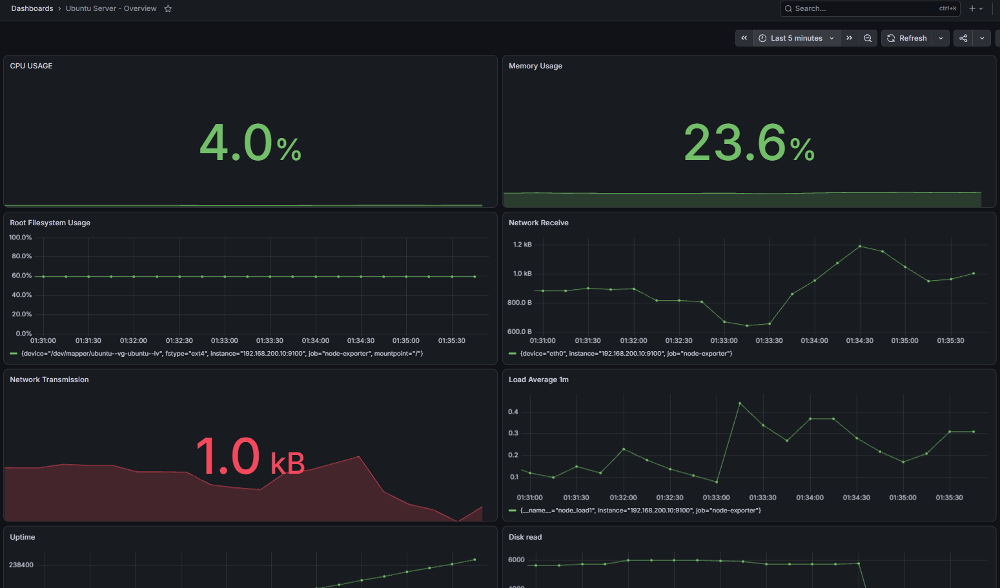
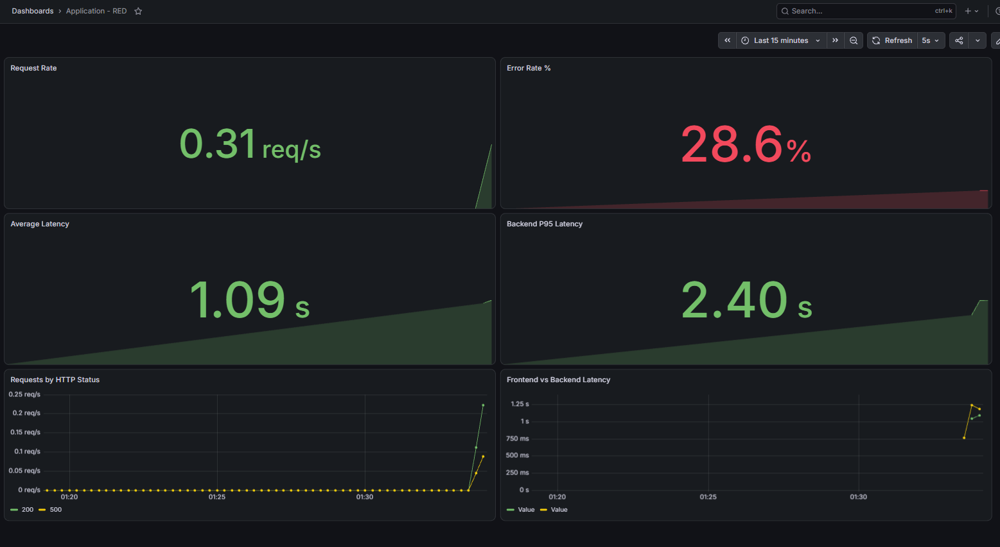
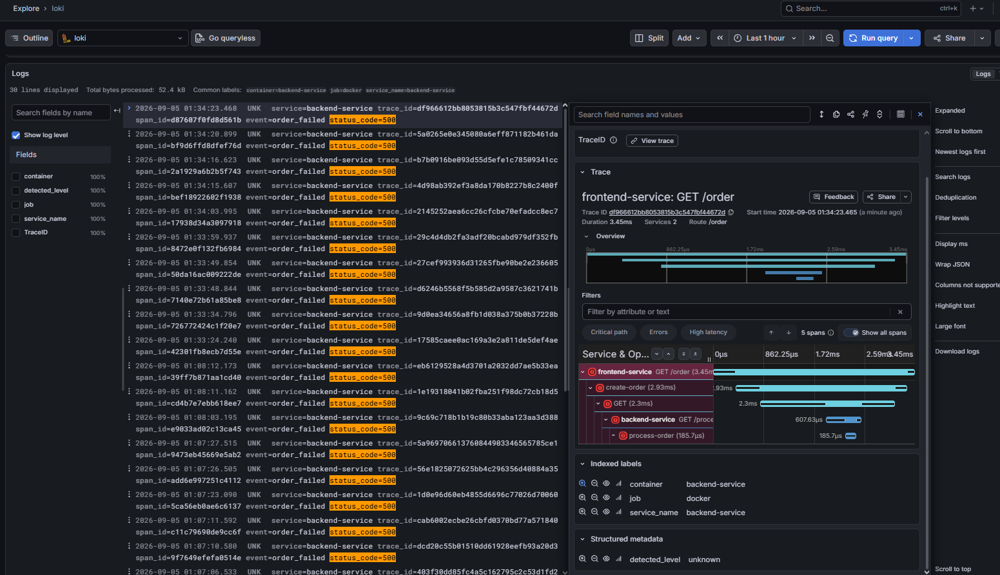
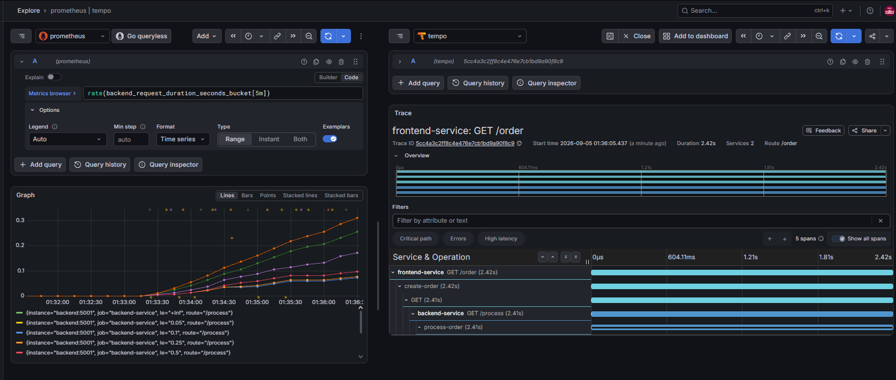
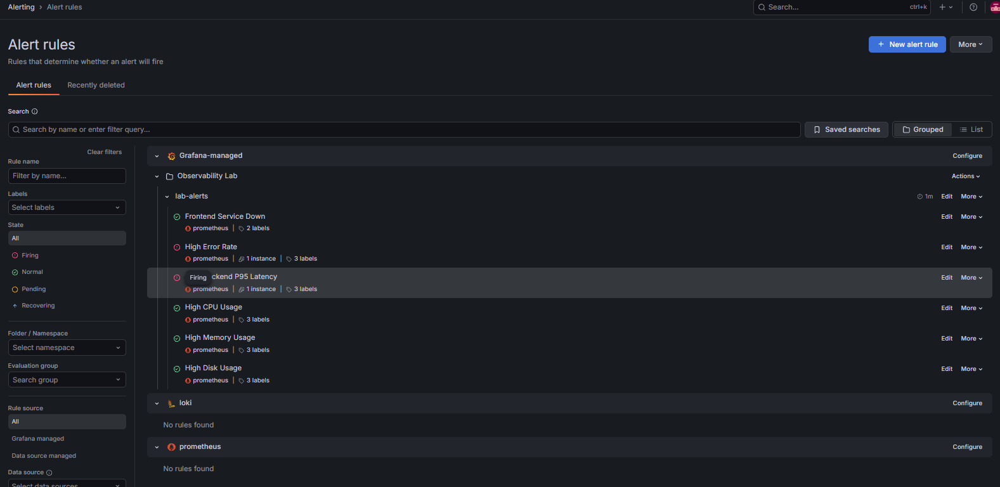
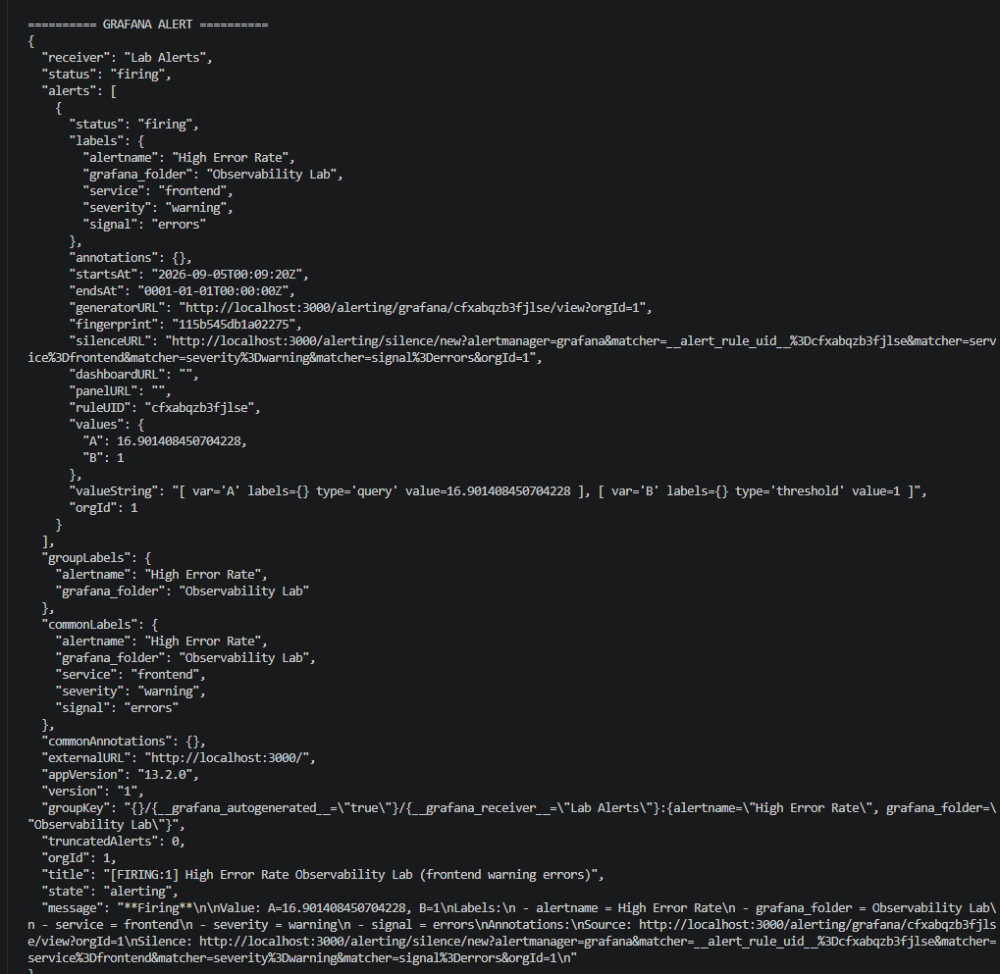

# Observability Lab

Hands-on observability environment built to study and demonstrate metrics, logs, distributed tracing, alerting, signal correlation, and incident investigation.

The project runs on an Ubuntu Server VM hosted on Hyper-V and uses a containerized observability stack built with Docker Compose.

> **End-to-end observability:** Metrics → Alerts → Logs → Trace ID → Distributed Trace → Root Cause
---

## Project Goals

This lab was created to practice real-world observability concepts rather than only deploying monitoring tools.

The environment demonstrates:

- Infrastructure monitoring
- Application metrics
- RED methodology
- Centralized logging
- Distributed tracing
- OpenTelemetry instrumentation
- Metrics, logs, and traces correlation
- Prometheus exemplars
- Grafana alerting
- Webhook notifications
- Incident simulation
- Root cause investigation

---

## Technology Stack

| Area | Technology |
|---|---|
| Operating System | Ubuntu Server 24.04 |
| Virtualization | Hyper-V |
| Containers | Docker / Docker Compose |
| Metrics | Prometheus |
| Host Metrics | Node Exporter |
| Visualization | Grafana |
| Logs | Loki |
| Log Collection | Grafana Alloy |
| Tracing | Grafana Tempo |
| Instrumentation | OpenTelemetry |
| Telemetry Pipeline | OpenTelemetry Collector |
| Applications | Python / Flask |
| Alerting | Grafana Alerting |
| Notifications | Custom Webhook Receiver |

---

## Architecture

```text
                         ┌──────────────┐
                         │   Grafana    │
                         └──────┬───────┘
                                │
                ┌───────────────┼────────────────┐
                │               │                │
                ▼               ▼                ▼
          ┌──────────┐     ┌─────────┐      ┌─────────┐
          │Prometheus│     │  Loki   │      │  Tempo  │
          └────┬─────┘     └────┬────┘      └────┬────┘
               │                │                │
               │                │                │
       ┌───────┴───────┐       │         ┌──────┴──────┐
       │ Node Exporter │       │         │OTel Collector│
       └───────────────┘       │         └──────┬──────┘
                               │                │
                            ┌──┴───┐            │
                            │Alloy │            │
                            └──┬───┘            │
                               │                │
                         Docker Logs            │
                               │                │
                     ┌─────────┴────────────────┴───────┐
                     │                                  │
              ┌──────▼───────┐                  ┌───────▼──────┐
              │   Frontend   │ ───── HTTP ────▶ │    Backend   │
              │   Service    │                  │    Service   │
              └──────────────┘                  └──────────────┘
```

The frontend communicates with the backend while both applications generate:

```text
Metrics
Logs
Traces
```

---

## Infrastructure Monitoring

The Ubuntu Server host is monitored using Prometheus and Node Exporter.

The infrastructure dashboard provides visibility into CPU, memory, filesystem usage, network traffic, load average, uptime, and disk I/O.



---

## Application RED Dashboard

The application dashboard follows the RED methodology:

- **Rate** — request throughput
- **Errors** — HTTP error percentage
- **Duration** — average and P95 request latency

The dashboard includes:

- Request Rate
- Error Rate
- Average Latency
- Backend P95 Latency
- Requests by HTTP Status
- Frontend vs Backend Latency



---

## Metrics

Prometheus collects both infrastructure and application metrics.

Application metrics include counters and histograms such as:

```text
frontend_requests_total
frontend_request_duration_seconds
backend_requests_total
backend_request_duration_seconds
```

P95 latency can be calculated using PromQL:

```promql
histogram_quantile(
  0.95,
  sum by (le) (
    rate(backend_request_duration_seconds_bucket[5m])
  )
)
```

---

## Logs and Trace Correlation

Docker logs are collected by Grafana Alloy and sent to Loki.

Application logs contain observability context including:

```text
service
trace_id
span_id
event
status_code
```

HTTP 500 errors can be filtered using LogQL:

```logql
{container="backend-service"} |= "status_code=500"
```

Because trace IDs are included in application logs, a failing request can be opened directly in Grafana Tempo.

This provides:

```text
Logs
  ↓
Trace ID
  ↓
Distributed Trace
```



---

## Distributed Tracing

The frontend and backend services are instrumented with OpenTelemetry.

Trace context is propagated between services:

```text
Client
  ↓
Frontend
  ↓
Backend
  ↓
OpenTelemetry Collector
  ↓
Tempo
```

A typical distributed trace contains:

```text
frontend-service: GET /order
└── create-order
    └── HTTP GET
        └── backend-service: GET /process
            └── process-order
```

This makes it possible to identify whether latency or failures originate in the frontend, network call, or backend operation.

---

## Metrics to Traces with Prometheus Exemplars

Prometheus histograms are instrumented with exemplars containing trace IDs.

Example:

```promql
rate(backend_request_duration_seconds_bucket[5m])
```

Grafana can use the exemplar trace ID to open the exact request in Tempo.

The investigation path becomes:

```text
Metric
  ↓
Exemplar
  ↓
Trace ID
  ↓
Tempo
  ↓
Individual Request
```



---

## Signal Correlation

The environment supports multiple observability correlation workflows:

```text
Logs → Traces

Traces → Logs

Traces → Metrics

Metrics → Traces
```

This allows investigations to move between telemetry signals instead of treating metrics, logs, and traces as isolated systems.

---

## Alerting

Grafana-managed alert rules were created for application and infrastructure conditions.

Implemented alerts:

- Frontend Service Down
- High Error Rate
- High Backend P95 Latency
- High CPU Usage
- High Memory Usage
- High Disk Usage



The rules use Prometheus metrics and configurable evaluation and pending periods.

---

## Alert Notification Delivery

Grafana alerts are routed to a custom webhook contact point.

A lightweight Python Flask receiver was created to simulate integration with an incident management or notification platform.

```text
Prometheus
    ↓
Grafana Alert Rule
    ↓
Grafana Alertmanager
    ↓
Contact Point
    ↓
Webhook
    ↓
Alert Receiver
```

The receiver captures metadata such as:

```text
alertname
status
severity
service
signal
```



Both firing and resolved notifications were validated.

---

## Incident Simulations

Several incidents were intentionally generated to validate the observability stack.

### Service Outage

The frontend container was stopped.

Prometheus detected:

```promql
up{job="frontend-service"} == 0
```

Grafana generated the `Frontend Service Down` alert and sent a webhook notification.

After the container was restarted, the rule returned to normal and a resolved notification was generated.

### High Error Rate

The backend application intentionally generates HTTP 500 responses.

The resulting incident can be investigated through:

```text
Grafana Alert
      ↓
RED Dashboard
      ↓
Loki
      ↓
status_code=500
      ↓
Trace ID
      ↓
Tempo
      ↓
Backend failure
```

### High Latency

Artificial backend processing delays generate slow requests.

Prometheus calculates backend P95 latency using histogram metrics, while Tempo shows the individual requests responsible for the latency.

### High CPU Usage

CPU pressure was generated using:

```bash
stress-ng --cpu "$(nproc)" --timeout 240s
```

### High Memory Usage

Memory pressure was generated using:

```bash
stress-ng --vm 1 --vm-bytes 60% --vm-keep --timeout 240s
```

### High Disk Usage

Filesystem usage was increased using temporary files, allowing the disk alert and recovery process to be tested.

---

## Incident Investigation Example

A simulated high error rate incident follows this workflow:

```text
High Error Rate Alert
        ↓
Application RED Dashboard
        ↓
HTTP 500 increase detected
        ↓
Loki logs
        ↓
status_code=500
        ↓
Trace ID
        ↓
Tempo distributed trace
        ↓
Backend service
        ↓
Failing operation identified
```

This demonstrates practical correlation between:

```text
Metrics + Logs + Traces
```

---

## Repository Structure

```text
observability-lab/
│
├── 01-linux/
├── 02-prometheus/
├── 03-grafana/
├── 04-loki-alloy/
├── 05-opentelemetry/
├── 06-full-stack/
│   ├── alert-receiver/
│   ├── alloy/
│   ├── backend/
│   ├── frontend/
│   ├── loki/
│   ├── otel/
│   ├── prometheus/
│   ├── tempo/
│   └── docker-compose.yml
│
├── 07-kubernetes/
├── docs/
│   └── images/
├── .gitignore
└── README.md
```

---

## Running the Full Stack

Start the environment:

```bash
cd 06-full-stack
docker compose up -d --build
```

Check the containers:

```bash
docker compose ps
```

Stop the environment:

```bash
docker compose down
```

---

## Service Ports

| Service | Port |
|---|---:|
| Grafana | 3000 |
| Prometheus | 9090 |
| Loki | 3100 |
| Tempo | 3200 |
| Grafana Alloy | 12345 |
| OpenTelemetry OTLP gRPC | 4317 |
| OpenTelemetry OTLP HTTP | 4318 |
| Frontend | 5000 |
| Backend | 5001 |
| Alert Receiver | 8081 |

---

## Skills Demonstrated

- Linux administration
- Docker
- Docker Compose
- Prometheus
- PromQL
- Node Exporter
- Grafana
- Grafana Alerting
- Loki
- LogQL
- Grafana Alloy
- OpenTelemetry
- OpenTelemetry Collector
- Distributed tracing
- Grafana Tempo
- Prometheus histograms
- Prometheus exemplars
- RED methodology
- Metrics / Logs / Traces correlation
- Alerting and notifications
- Incident simulation
- Troubleshooting
- Root cause analysis

---

## Next Steps

Future improvements planned for this lab:

- Kubernetes deployment
- Kubernetes observability
- OpenTelemetry auto-instrumentation
- SLI / SLO implementation
- Recording rules
- Advanced alert routing
- Alert severity policies
- Service dashboards
- Synthetic monitoring
